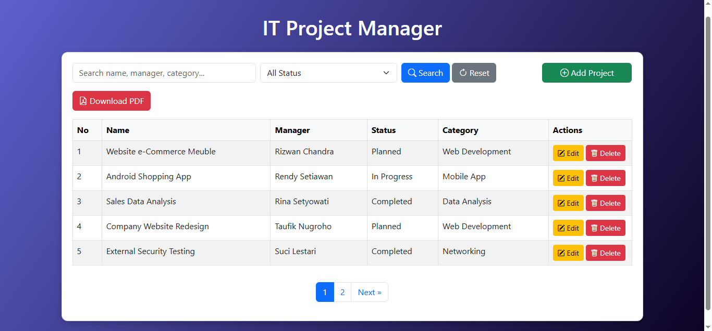

# í·‚ Website CRUD PHP & MySQL

Project ini merupakan **website CRUD sederhana menggunakan PHP dan MySQL**.

Aplikasi ini dapat melakukan operasi dasar database yaitu:

Create  
Read  
Update  
Delete

Project ini juga dilengkapi fitur **export data ke PDF menggunakan DomPDF**.

---

# ✨ Fitur Aplikasi

- Menampilkan data dari database
- Menambah data baru
- Mengedit data
- Menghapus data
- Export data ke PDF
- Koneksi database MySQL

---

# í»  Teknologi yang Digunakan

- PHP Native
- MySQL
- HTML
- CSS
- DomPDF

---

# í³‚ Struktur Project

WebsiteCrud

index.php → Halaman utama  
create.php → Menambah data  
edit.php → Mengedit data  
delete.php → Menghapus data  
koneksi.php → Koneksi database  
pdf.php → Export PDF  

crud_it.sql → Database  

dompdf → Library PDF  

preview.png → Screenshot aplikasi

---

# í³¸ Tampilan Aplikasi

---

# í±¨â€�í²» Author

BangSesa

GitHub  
https://github.com/BangSesa
